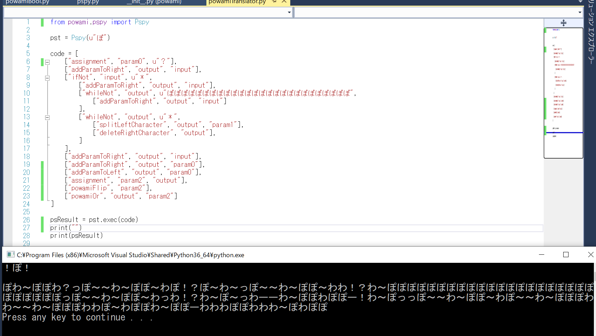

# Pspy
人にとって意味が分かる、Lisp風スクリプトを[ぽわみスクリプト](https://github.com/penpenpng/powami-script)に変換するPythonモジュールです。リポジトリ内のpowamiフォルダを使用するPythonコードのあるフォルダに配置して使ってください。
サンプルコードは"powamiTranslator.py"です。



#使用方法
このスクリプトでは1つの命令文を1つのリストとして表現し、複数の命令文（リスト）を格納するリストを`Pspy`オブジェクトに
渡すことで実行されます。

```
from powami.pspy import Pspy

pst = Pspy(u"ぽ")

code = [
    ["assignment", "param0", u"？"],
    ["addParamToRight", "output", "input"],
    ["addParamToRight", "output", "param0"],
    ["addParamToLeft", "output", "param0"],
]

psResult = pst.exec(code)
```

* `Pspy(input_str)`
`Pspy`クラスのオブジェクトを初期化し、`input_str`のぽわみ文字列が入力として渡されます。
※ぽわみ文字列...`ぽわ！？～ー`のみから構成される文字列

* `Pspy.exec(code)`
codeのリスト内にある命令文を実行し、さらにcodeをぽわみスクリプトに変換します。
このメソッドの処理の最後で、`output`変数（ぽわみスクリプトではわ～ぽ）に格納されたぽわみ文字列が出力されます。
このメソッドは変換されたぽわみスクリプトを返します。

# リファレンス

## 変数
ぽわみスクリプトでは10個の変数が用意されていますが、このスクリプトでは以下のような名前にしております。

* `input`...入力が入る変数（ぽ～わ）

* `output`...出力を入れる変数（わ～ぽ）

* `paramP`...初期値"ぽ"が入っている変数（ぽぽぽ）

* `paramW`...初期値"わ"が入っている変数（わわわ）

* `param0` `param1` `param2` `param3` `param4` `param5`...その他使用できる6つの変数

## 命令語
基本的に[命令語, 引数1, 引数2]というように3つの要素から構成されます。引数2は命令語によって不要な場合があります。命令語に必要な数の要素が足りていれば、オーバーしている分は無視する形で動きます。

|  命令語  |  引数1　|  引数2  | 説明                                                                                                             |
| :------: | :------: | :------: | :--------------------------------------------------------------------------------------------------------------- |
|  assignment  |   変数名   |  変数名 or ぽわみ文字列  | 引数1 に 引数2を代入する。
|  addParamToRight  |   変数名   |   変数名   | 引数1 を 引数1 の右側に 引数2 を繋げたものにする。|
|  addParamToLeft  |  変数名  |   変数名   | 引数1 を 引数1 の左側に 引数2 を繋げたものにする。   |
|  splitRightCharacter  |    変数名     |   変数名   | 引数1 を 引数1 の右端 1 文字を削除したものにし、引数2 を削除した 1 文字にする。削除に失敗した時 引数2 は空文字列になる。 |
|  splitLeftCharacter  |    変数名     |   変数名   | 引数1 を 引数1 の左端 1 文字を削除したものにし、引数2 を削除した 1 文字にする。削除に失敗した時 引数2 は空文字列になる。 |
|  deleteRightCharacter  |    変数名     |   不要   | 引数1 を 引数1 の右端 1 文字を削除したものにする。|
|  deleteLeftCharacter  |    変数名     |   不要   | 引数1 を 引数1 の左端 1 文字を削除したものにする。|
| powamiFlip |    変数名     |   不要   | 引数1 を 引数1 の **反転** にする。|
|   powamiAdd   |    変数名     |   変数名   | 引数1 を 引数1 と 引数2 の **積** にする。|
|   powamiOr   |    変数名     |   変数名   | 引数1 を 引数1 と 引数2 の **和** にする。 |   

`powamiFlip`, `powamiAnd`, `powamiOr`にある反転、積、和についての詳細は[ぽわみスクリプト](https://github.com/penpenpng/powami-script)をご覧ください

## 制御文
追記中
